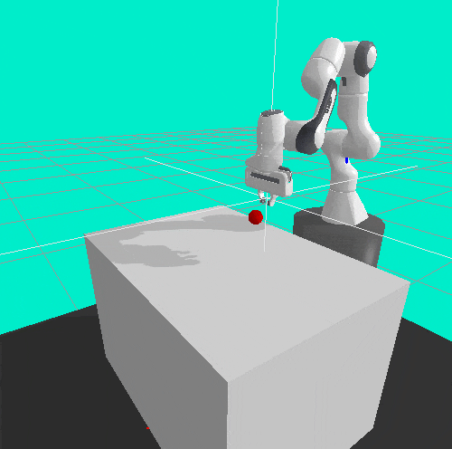

# Manipulator_DeepReinforceLearning
OpenaAI Gym robot reaching environment with PyBullet.

Anyway, here is the env in action, agent was trained with PPO. 

| | Agent performance at different training episodes | |
|:-------------------------:|:-------------------------:|:-------------------------:|
||||
||||

## Install

Install with `pip`:

    git clone https://github.com/LiboPM/Manipulator_DeepReinforceLearning
    cd gym-panda-reach
    pip install .

## Basic Usage 

Example running of the environment:

```python
import gym
import gym_panda_reach
env = gym.make('me5412')
env.reset()
env.reward_type = "sparse" #default is "dense"
for _ in range(100):
    env.render()
    obs, reward, done, info = env.step(
        env.action_space.sample()) # take a random action
env.close()
```
